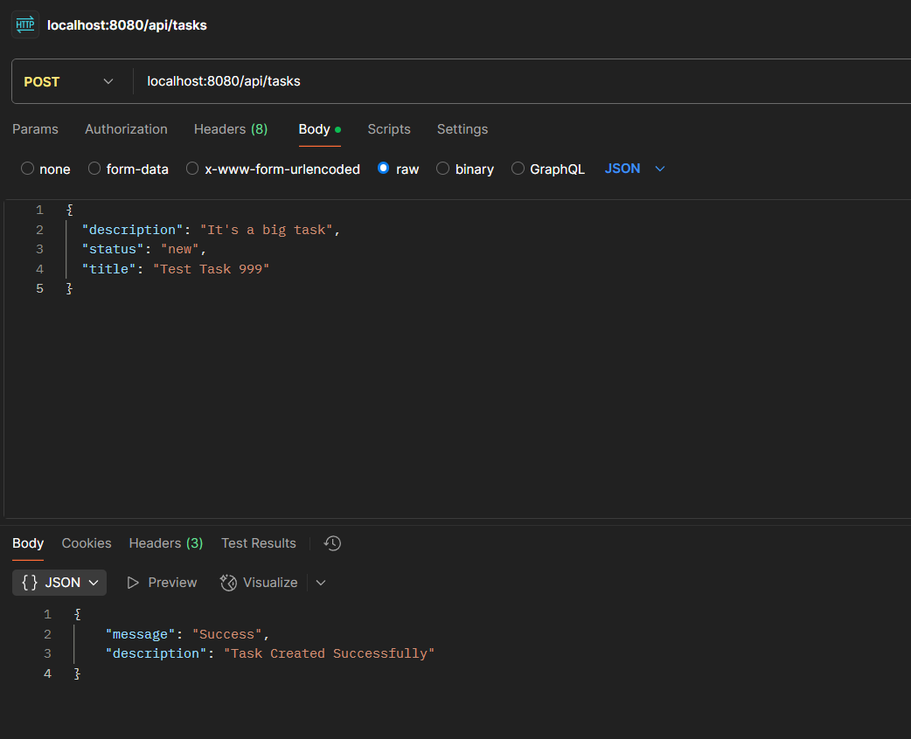
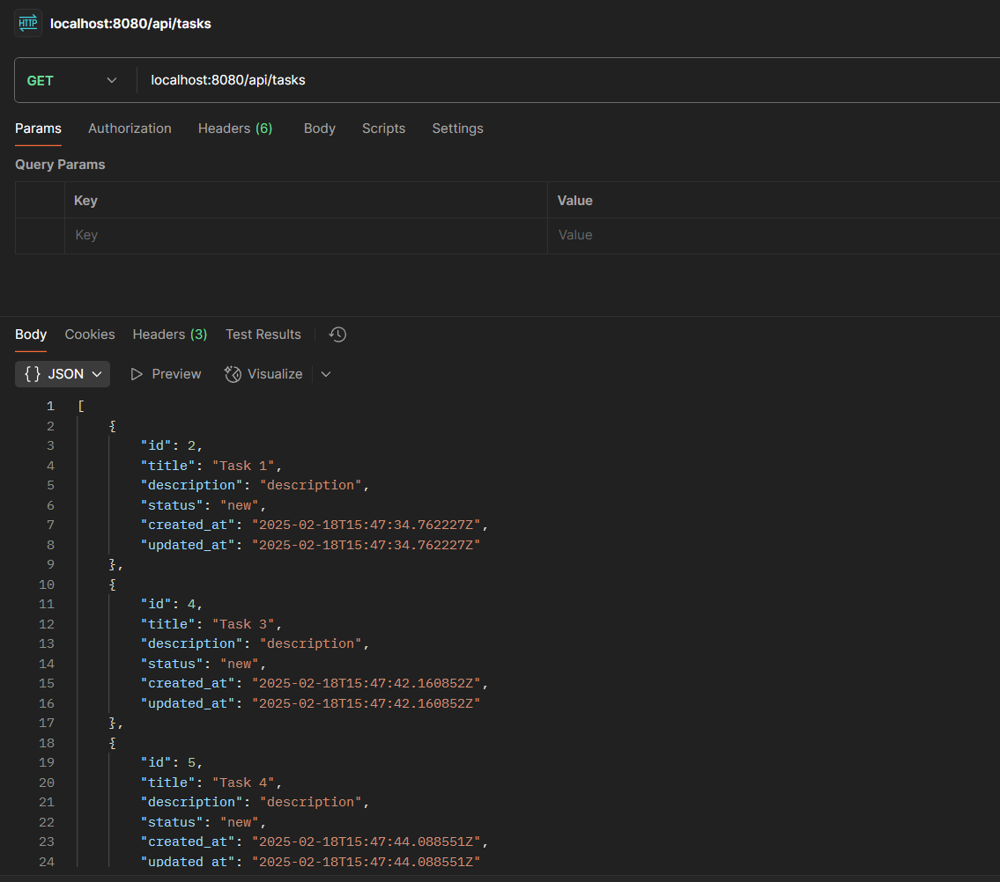
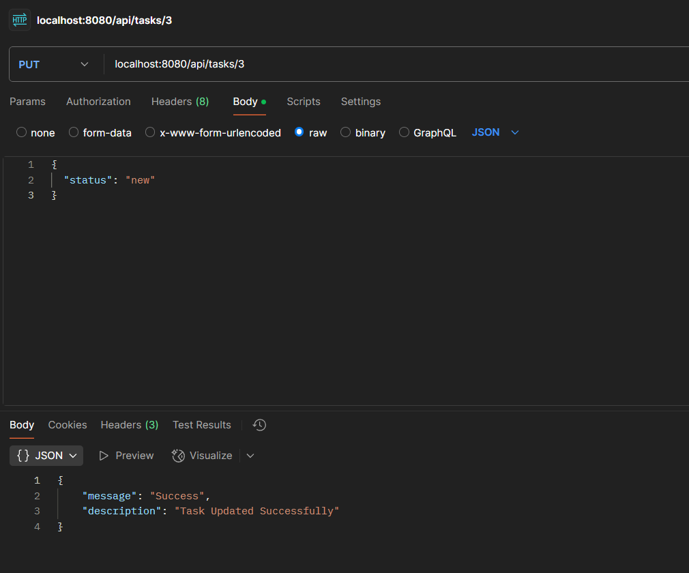
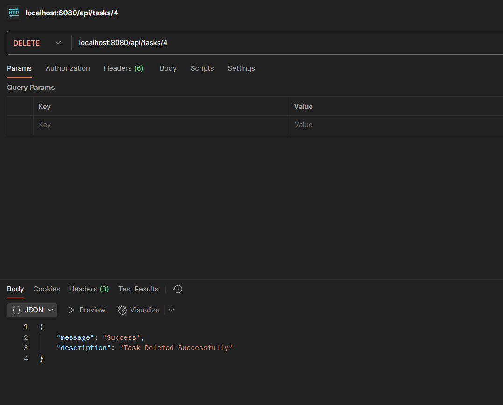
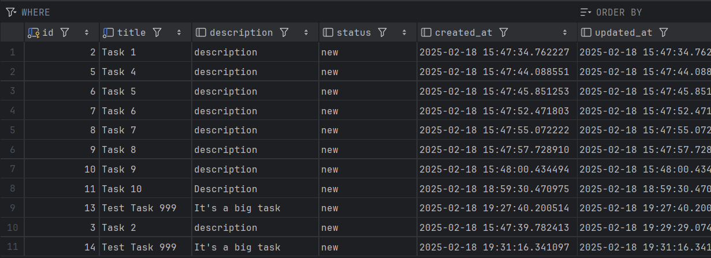

# Тестовое задание "Список задач"
## Выполнил: Корешков Даниил

### Запуск dev-среды

Запуск backend осуществляется через **MakeFile** <br>
Перед тем, как запустить скрип, необходимо:
- Заполнить конфигурационный файл **.env-example**
- Переименовать файл **.env-example** в **.env**

##### Код запуска dev-среды (api запускается локально):
```bash
    make create-app
```

##### Код перезапуска dev-среды:
```bash
    make restart-app
```

Если запуск осуществлялся впервые:

##### Необходимо запустить миграции в БД при помощи команды:
```bash
    make create-migrations
```

Если есть необходимость очистить базу:

##### Необходимо запустить откат миграций БД при помощи команды:
```bash
    make delete-migrations
```


### Как попасть в Swagger:
Если вы использовали базовые настройки из .env-example, то достаточно после запуска нажать [**сюда**](http://localhost:8080/swagger/index.html#/)

#### В другом случае, путь до Swagger:
* Port - порт из .env-example

* Host - ваш ip/домен хоста

http://[**host**]:[**port**]/swagger/index.html#/

#### Можно запустить написанные тесты, проверить работу в Swagger или работа отображена на скриншотах ниже:

# Post Request


# Get Request


# Put Request


# Delete Request


# Результат из БД

